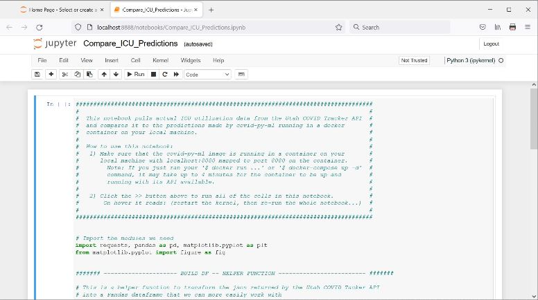
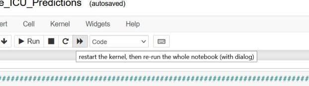
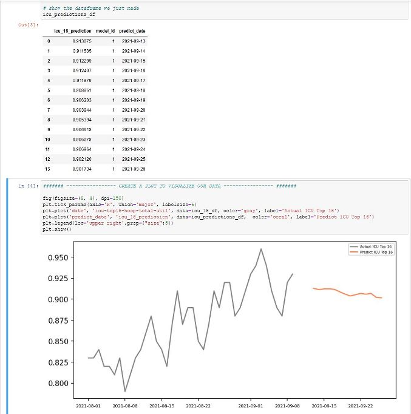

# covid-py-ml

# ! Notice - Predictions no longer working !
At the end of January, the State of Utah changed the way that testing data is published to coronavirus.utah.gov. This made it challenging for the Utah Covid Tracker API to collect COVID testing data. Testing data is a key variable in this prediction model. Even though this machine learning model is no longer able to make active predictions, I think it is a good example of how to create a containerized ML tool with python. I will let it live on as a reference for myself and others for future projects.  
  
The specific endpoint that is no longer publishing new data is `https://utahcovidtrack.com/api/icu/top-16`. Test data is only available thorugh 1/26/2022.

## Overview

covid-py-ml is a machine learning application used to predict the ICU utilization for the top 16 hospitals in Utah by analyzing data provided by the Utah COVID Tracker API. This application also provides a rest API to access the models and predictions it generates. You can find documentation for the Utah COVID Tracker API at https://utahcovidtrack.com/developer/api-docs.  
  
Once the covid-py-ml docker image is built and running as a container, it will send a request to the Utah COVID Tracker API at 15 minutes past the hour, every hour, to check for new data. If new data is returned, covid-py-ml will rebuild its predictive model and make a prediction of ICU capacity for the top 16 hospitals two weeks from the current date. The first time the routine runs, two weeks of daily predictions are generated. The state of Utah typically publishes new data once per day between Noon and 2 PM Mountain Time.
  
covid-py-ml uses scikit-learn's LinearRegression model to build multiple linear and polynomial regression models based on the environment variables provided at container runtime. The 7 day moving averages of COVID case count and positive test rates for the entire State of Utah serve as the features for the model.  
    
Sqlite is utilized to store data for this appllication. In the `docker run` and `docker compose` commands below, docker volumes are created and mapped for persitent storage of the Sqlite database file and application log files.

Becuase of the Delta variant, a linear model (MOCEL_N=1) using data after 5/1/2021 (CUTOFF_DATE=2021-05-01) seems to generate the most accurate predictions.  

NOTE: This project is just for fun and learning. It should NOT, in any way, be considered medical or scientific advice.

## Requirements

 - OS: Windows or Linux
 - Python 3.8 or 3.9
 - Docker
 - Docker Compose (optional)

## Quick start guide

The prebuilt docker image can be used to spin up a container running the covid-py-ml application. The docker image is hosted on GitHub at ghcr.io.

Start the container with the following command:  

`docker run -itd -e CUTOFF_DATE=2021-05-01 -e MODEL_N=1 --name covid_py_ml -v covid_py_ml_db:/home/covidml/python_apps/apps/data -v covid_py_ml_logs:/home/covidml/covid_py_ml_logs -p 0.0.0.0:8080:8080 ghcr.io/shinyshoes404/covid-py-ml:latest`  

 - Notice the two optional environment variables listed in the command above
   - CUTOFF_DATE is the oldest observation date that will be used to build the regression model
   - MODEL_N is the polynomial degree that will be used for the regression model (MODEL_N=1 indicates a linear model)
   -  If no environment variables are provided, then all available data will be used and a linear model will be created.
 - It will take about 3-4 minutes for the container to fully spin up
 - Two persistent docker volumes will be mapped to store the logs and Sqlite database file
 - The API will be available via port 8080 at the following endpoints
    - `http://localhost:8080/ml/api/models` -- provides a list of all models built to date
    - `http://localhost:8080/ml/api/predictions` -- provides a list of all predictions made to date
    - `http://localhost:8080/ml/api/model-data/<model id>` -- provides the data used to create the model, where the model id is provided as an integer in place of `<model id>`

## Building the docker image yourself

If you don't want to pull the docker image from the GitHub container registry, you can build the image yourself using the Dockerfile provided in this project. Before building the image, you can edit the Dockerfile to change the timezone, default user, and whatever else you want.  
  
The Dockerfile will:
 - Start with Ubuntu 20.04
 - Run `apt-get update` and `apt-get upgrade`
 - Set the timezone of the system
 - Disable the root user
 - Create the default user to run the app
 - Install pip3
 - Copy in the requirements.txt and install required dependencies
 - Copy in the bash scripts used to run the application
    - run_db_setup.sh -- creates the sqlite database used by the application
    - run_api.sh -- starts the api
    - run_ml.sh -- starts the covid-py-ml machine learning routine
 
### Build the image

 - Clone this project by running `git clone https://github.com/shinyshoes404/covid-py-ml.git`
 - Move into the root of this project `cd covid-py-ml`
 - Build the docker image with `docker build -t covid-py-ml:latest .`
 - The build will take a few minutes to run. When it is done, you should see `covid-py-ml:latest` listed when you run `docker images`.

### Start the container

#### Option 1: Docker run
  
`docker run -itd -e CUTOFF_DATE=2021-05-01 -e MODEL_N=1 --name covid_py_ml -v covid_py_ml_db:/home/covidml/python_apps/apps/data -v covid_py_ml_logs:/home/covidml/covid_py_ml_logs -p 0.0.0.0:8080:8080 covid-py-ml:latest`  
 
 - Notice the two optional environment variables listed in the command above
   - CUTOFF_DATE is the oldest observation date that will be used to build the regression model
   - MODEL_N is the polynomial degree that will be used for the regression model (MODEL_N=1 indicates a linear model)
   -  If no environment variables are provided, then all available data will be used and a linear model will be created.

#### Option 2: Docker compose

If docker compose is installed, you can run `docker-compose up -d`.  

 - In the docker-compose.yml file, you will notice the `environment:` section
    - CUTOFF_DATE is the oldest observation date that will be used to build the regression model
    - MODEL_N is the polynomial degree that will be used for the regression model (MODEL_N=1 indicates a linear model)
    -  If no environment variables are provided, then all available data will be used and a linear model will be created.

### Accessing the API

 - It will take about 3-4 minutes for the container to fully spin up
 - Two persistent docker volumes will be mapped to store the logs and Sqlite database file
 - The API will be available on port 8080 at the following endpoints
    - `http://localhost:8080/ml/api/models` -- provides a list of all models built to date
    - `http://localhost:8080/ml/api/predictions` -- provides a list of all predictions made to date
    - `http://localhost:8080/ml/api/model-data/<model id>` -- provides the data used to create the model, where the model id is provided as an integer in place of `<model id>`

## Dev and Testing

### Installing for dev and testing

 - Clone this project by running `git clone https://github.com/shinyshoes404/covid-py-ml.git`
 - Move into the root of this project `cd covid-py-ml`
 - Activate your python virtual environment (optional, but recommended)
 - Install the covid-py-ml packages and dependencies with `pip install -e .[dev]`
    - setup.py is used with `pip install` when installing for development to enable the test modules located in `src/tests/` to run
    - The requirements.txt file is only used when building the docker image

### Testing 

If you make any changes to the source code, you should verify everthing is working by running the unit tests and integreation tests in the project. To do that, use __coverage__ and __unittest__ to run test cases and measure code coverage for just the code written for this project.  

`coverage run --source=src/covid_py_ml -m unittest discover -v -s src/tests`  
  
Run `coverage report` to see a report of the amount of code covered by the tests that just ran.

## Exploring the data

### Installing with explore option

Installing with the explore option will give you all of the tools you would get from installing for dev and testing, but will also install __jupyter notebook__ and __matplotlib__ to make it easy to work with and visualize our predictions.  

 - Clone this project by running `git clone https://github.com/shinyshoes404/covid-py-ml.git`
 - Move into the root of this project `cd covid-py-ml`
 - Activate your python virtual environment (optional, but recommended)
 - Install the covid-py-ml packages and dependencies with `pip install -e .[explore]`

### Start jupyter notebook

Once you have built the docker image and started the container (see __Quick Start Guide__ or __Building the docker image yourself__ above), you can use __jupyter notebook__ to fetch the predictions from the container, and compare them to the actual ICU utilization data. The actual ICU utilziation data is pulled from Utah COVID Tracker's API.

 - From the terminal, move into the `notebook/` directory with `cd notebook`
 - Start Jupyter Notebook by running `jupyter notebook`
     - This will open a browser running Jupyter Notebook

   

   &nbsp;

 - Click the the link for __Compare_ICU_Predictions.ipynb__

   

   &nbsp;

 - Click the double arrow button to restart the kernel and run all cells

   

   &nbsp;

 - After a few seconds, you should start to see dataframe outputs and a chart plotting actual ICU utilization data vs predictions

   

   &nbsp;
 
 - After new COVID data is published by the State of Utah, you can click the double arrow button again to refresh the dataframes and chart (assumes your container is still running when the new data is published)